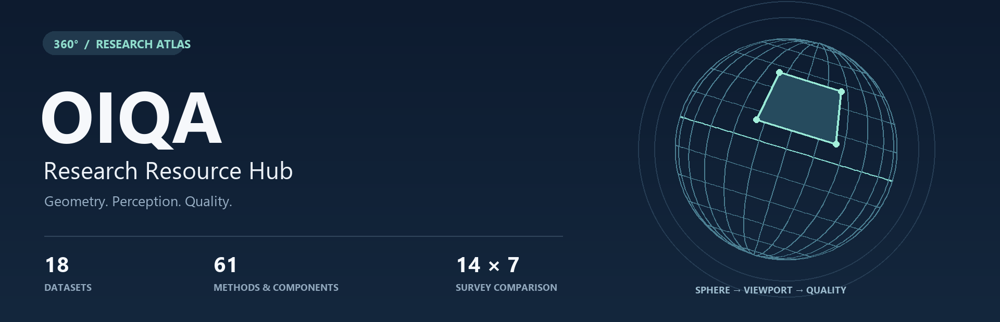
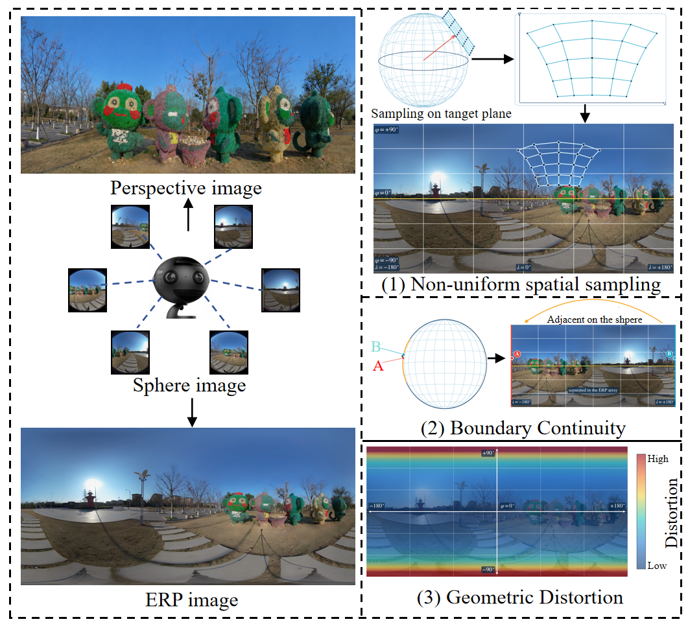
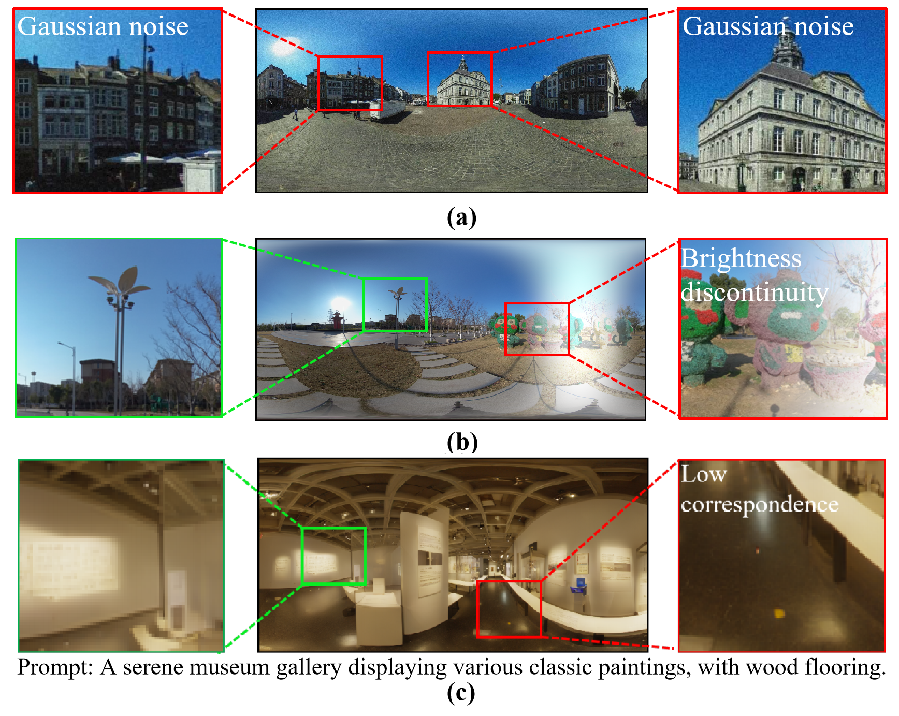
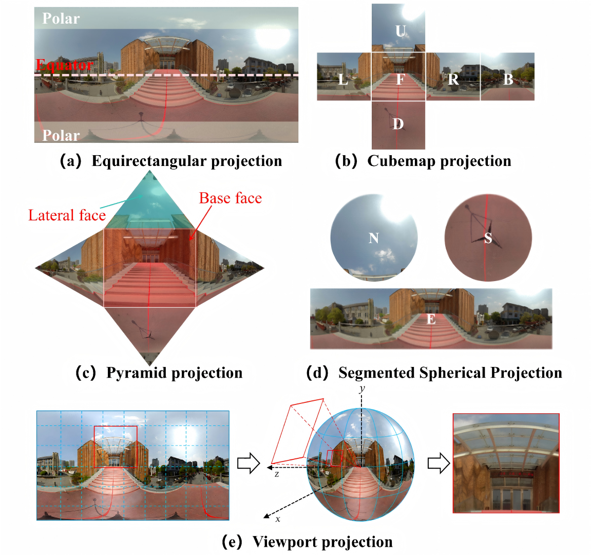
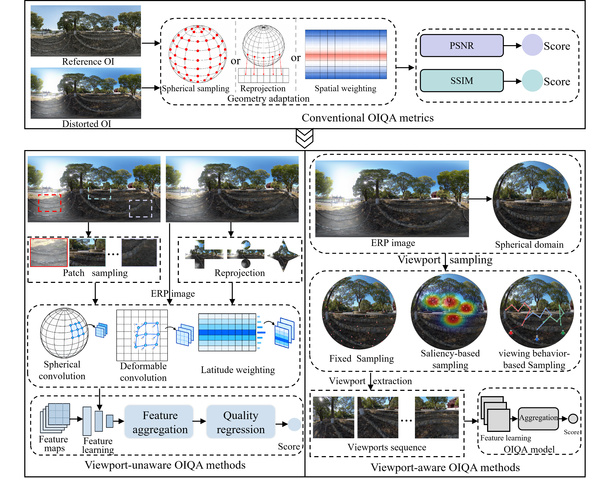

<div align="center">
  
  <h1>Omnidirectional Image Quality Assessment</h1>
  <p><strong>Spherical geometry, human viewing behavior, and perceptual quality.</strong></p>
  <p>Papers &nbsp; · &nbsp; Datasets &nbsp; · &nbsp; Implementations &nbsp; · &nbsp; Quantitative Comparisons</p>
  <p>
    <a href="#overview">Overview</a> &nbsp; / &nbsp;
    <a href="#datasets">Datasets</a> &nbsp; / &nbsp;
    <a href="#methods">Methods</a> &nbsp; / &nbsp;
    <a href="#benchmark">Comparison</a> &nbsp; / &nbsp;
    <a href="#citation">Citation</a>
  </p>
</div>

A companion resource index for **A Survey of Omnidirectional Image Quality Assessment: Challenges, Status, and Future Work**. It brings together conventional metrics, viewport-unaware and viewport-aware OIQA methods, and datasets for homogeneous, heterogeneous, and multimodal OIQA.

**Authors:** Kangcheng Wu · Jiebin Yan · Hanwei Zhu · Jingwen Hou · Yuming Fang  
**Source pages checked:** October 9, 2026 · [Dataset access guide](docs/datasets.md) · [Method details](docs/methods.md) · [Sources and verification](docs/link-audit.md)

---

<a id="start"></a>
## Start Exploring

| Research goal | Where to begin |
| :--- | :--- |
| Understand what distinguishes OIQA from 2D-IQA | [Geometry and distortions](#overview) → [Projection formats](#projections) → [Method taxonomy](#methods) |
| Select training and evaluation data | [Dataset index](#datasets), with access conditions, annotations, and score conventions in the details |
| Explore public implementations | [Assessor360](https://github.com/TianheWu/Assessor360) · [OIQAND](https://github.com/RJL2000/OIQAND) · [IQCaption360](https://github.com/WenJuing/IQCaption360) |
| Study viewport-unaware quality modeling | [VU-BOIQA](https://github.com/KangchengWu/OIQA) · [VUGA](https://github.com/KangchengWu/VUGA) · [GAQC](https://github.com/liziyi1234/GAQC) |
| Study viewing behavior and scanpaths | [ScanDMM](https://github.com/xiangjieSui/ScanDMM) · [GSR](https://github.com/xiangjieSui/GSR) · [RL-ScanIQA](https://github.com/wangyuji1/RLScanIQA) |
| Read the survey's quantitative comparison | [Results and interpretation](#benchmark) · [Complete results for 14 methods across 7 databases](docs/benchmark.md) |

<a id="overview"></a>
## 01 / Overview

**Omnidirectional images (OIs)** represent visual content on a sphere. Their planar projections introduce challenges that distinguish **omnidirectional image quality assessment (OIQA)** from **two-dimensional image quality assessment (2D-IQA)**: **non-uniform spatial sampling**, **boundary continuity**, and **geometric distortion**. Human viewing behavior further determines which local regions and distortions contribute to perceived quality.

<p align="center">
  <a href="assets/figures/gap.png"></a><br>
  <sub><b>Figure 1.</b> Geometric differences between perspective images and OIs. Select any figure to view its full resolution.</sub>
</p>

| Challenge | Implication for quality assessment |
| :--- | :--- |
| **Reference image acquisition** | Capturing and stitching an OI can introduce residual degradation, complicating the definition of a pristine reference. |
| **Subjective quality assessment** | Head-mounted display (HMD) experiments must account for starting points, exploration time, viewing behavior, and fatigue. |
| **Objective quality assessment** | Models must account for content degradation, projection geometry, and the visual content actually explored by observers. |

### Distortions and Perceptual Quality

<p align="center">
  <a href="assets/figures/distortion.png"></a><br>
  <sub><b>Figure 2.</b> Homogeneous, heterogeneous, and AIGC-specific distortions motivate different quality assessment settings.</sub>
</p>

<a id="projections"></a>
## 02 / Projection Formats

<p align="center">
  <a href="assets/figures/projection.png"></a><br>
  <sub><b>Figure 3.</b> Five projection formats for the same spherical scene, with different sampling densities, geometric distortions, and spatial coverage.</sub>
</p>

| Format | Geometric properties | Modeling considerations |
| :--- | :--- | :--- |
| **Equirectangular projection (ERP)** | Rectangular representation with pronounced polar stretching | Latitude-dependent sampling, geometry-adaptive features, and global context |
| **Cubemap projection (CMP)** | Six cube faces with reduced geometric distortion | Face boundaries and cross-face feature fusion |
| **Segmented spherical projection (SSP)** | Separate equatorial and polar regions | Region-specific modeling and spherical coverage |
| **Pyramid projection (PYM)** | Higher sampling density around a predefined viewing direction | Unequal detail across directions and complementary projections |
| **Viewport projection** | Perspective projection of a local spherical region | Field of view, viewport coverage, sequential dependencies, and quality aggregation |

<a id="datasets"></a>
## 03 / Datasets

The following groups use the task names in **Table 2** of the survey. Years and image counts follow that table; the [dataset access guide](docs/datasets.md) adds distortion types, score ranges, maximum resolutions, access codes, and source-specific qualifications.

**Access labels:** *Author release* identifies downloads listed by the authors; *Request* requires a form or contact with the authors; *Research mirror* identifies a third-party research source. *Paper only* and *Project page* indicate the entry currently provided. Links were checked against source pages; complete datasets were not downloaded.

### Homogeneous OIQA

| Dataset · year | Scale¹ | Research focus | Access | Resources |
| :--- | ---: | :--- | :--- | :--- |
| **[CVIQ](docs/datasets.md#dataset-1)** · 2018 | 16 / 528 | Compression distortions | Author release | [Download](https://pan.baidu.com/s/1b3j5iO3jQWf2fZPAli9ozw) · [Project](https://github.com/sunwei925/CVIQDatabase) · [Paper](https://doi.org/10.1109/mmsp.2018.8547102) |
| **[OIQA](docs/datasets.md#dataset-2)** · 2018 | 16 / 320 | Blur, noise, and compression | Research mirror | [Mirror](https://mega.nz/file/FqxxRQRR#4Ju2qcmmo6Ced_7nRBXXqAaDcjqxjH2uUFnXIeyE2ts) · [Source](https://github.com/xiangjieSui/GSR) · [Paper](https://doi.org/10.1109/iscas.2018.8351786) |
| **[MVAQD](docs/datasets.md#dataset-3)** · 2021 | 15 / 300 | Multiple distortions and visual attention | Email request | [Request details](https://github.com/Jianghao2019/MVAQD) · [Paper](https://doi.org/10.1109/tip.2021.3052073) |
| **[IQA-ODI](docs/datasets.md#dataset-4)** · 2021 | 120 / 960 | JPEG and projection distortion | Author release | [Download](https://www.dropbox.com/s/agmu8ljwal6a25e/all_ref_test_img.zip?dl=0) · [Project](https://github.com/yanglixiaoshen/SAP-Net) · [Paper](https://doi.org/10.1109/icme51207.2021.9428390) |
| **[LIVE 3D VR IQA](docs/datasets.md#dataset-5)** · 2019 | 15 / 450 | Stereoscopic quality and eye tracking | Request form | [Request](https://forms.gle/p7bC5P5W6C3md3wT6) · [Project](https://live.ece.utexas.edu/research/VR3D/index.html) · [Paper](https://doi.org/10.1109/jstsp.2019.2956408) |
| **[NBU-HOID](docs/datasets.md#dataset-6)** · 2021 | 16 / 320 | HDR and tone mapping | Author release | [Download](https://pan.baidu.com/s/1lzr7NUqhfQJb4gxyAE5cJA) · [Project](https://github.com/caoliuyan/NBU-HOID) · [Paper](https://doi.org/10.1109/tim.2021.3093940) |
| **[NBU-SOID](docs/datasets.md#dataset-7)** · 2021 | 12 / 396 | Stereoscopic compression distortions | Author release | [Download](https://pan.baidu.com/s/1UKjtZ6XRJ46AF9Hf7vQpOw) · [Project](https://github.com/qyb123/NBU-SOID) · [Paper](https://doi.org/10.1109/tcsvt.2020.3043349) |
| **[SOLID](docs/datasets.md#dataset-8)** · 2018 | 6 / 276 | Stereoscopic quality and depth perception | Request form | [Request](https://jinshuju.net/f/u3EPcv) · [Project](https://faculty.ustc.edu.cn/chenzhibo/zh_CN/article/988216/content/2461.htm) · [Paper](https://doi.org/10.1007/978-3-030-00776-8_54) |

### Heterogeneous OIQA

| Dataset · year | Scale¹ | Research focus | Access | Resources |
| :--- | ---: | :--- | :--- | :--- |
| **[ISIQA](docs/datasets.md#dataset-9)** · 2019 | 26 / 264 | Stitching distortion | Download + password request | [Download](http://ece.iisc.ac.in/~rajivs/databases/isiqa_release.zip) · [Project](https://pavancm.github.io/stitched-qa/) · [Paper](https://doi.org/10.1109/tip.2019.2921858) |
| **[CROSS](docs/datasets.md#dataset-10)** · 2019 | 292 / 2044 | Cross-reference stitching quality | Paper only | [Paper](https://doi.org/10.1145/3343031.3350973) |
| **[JUFE](docs/datasets.md#dataset-11)** · 2022 | 258 / 1032 | Viewing conditions and non-uniform distortions | Author release | [Download](https://pan.baidu.com/s/1HU3Qp8BCGdCXynYN0ZPTXQ) · [Project](https://github.com/LXLHXL123/JUFE-VRIQA) · [Paper](https://doi.org/10.1609/aaai.v36i1.19937) |
| **[OSIQA](docs/datasets.md#dataset-12)** · 2023 | 300 / 300 | Color, geometric, blur, and ghosting artifacts | Paper only | [Paper](https://doi.org/10.1109/jstsp.2023.3250956) |
| **[JUFE-10K](docs/datasets.md#dataset-13)** · 2024 | 430 / 10320 | Large-scale non-uniform distortions | Author release | [Download](https://pan.baidu.com/s/1eL1yee3wISC1QVn4zXnXrw) · [Project](https://github.com/RJL2000/OIQAND) · [Paper](https://doi.org/10.1109/tmm.2025.3535372) |
| **[OIQ-10K](docs/datasets.md#dataset-14)** · 2024 | 2500 / 7500 | Mixed distortions and quality captioning | Author release | [Download](https://pan.baidu.com/s/1Uy0AR9B2oCAIJuLCuZEtLg) · [Project](https://github.com/WenJuing/IQCaption360) · [Paper](https://doi.org/10.1109/tip.2025.3539468) |

### Multimodal OIQA

| Dataset · year | Scale¹ | Research focus | Access | Resources |
| :--- | ---: | :--- | :--- | :--- |
| **[OIQ-10K+](docs/datasets.md#dataset-15)** · 2025 | 2500 / 7500 | Images and quality descriptions | Request from authors | [Request details](https://link.springer.com/article/10.1007/s11263-025-02626-w) · [Paper](https://doi.org/10.1007/s11263-025-02626-w) |
| **[JUFE-10K+](docs/datasets.md#dataset-16)** · 2025 | 430 / 10320 | Multimodal quality modeling | Request from authors | [Request details](https://link.springer.com/article/10.1007/s11263-025-02626-w) · [Paper](https://doi.org/10.1007/s11263-025-02626-w) |
| **[AIGCOIQA2024](docs/datasets.md#dataset-17)** · 2024 | - / 300 | AI-generated OIs and text correspondence | Author release | [Download](https://terabox.com/s/17YIkFc-PFeviUbtGP1ReYQ) · [Project](https://github.com/IntMeGroup/AIGCOIQA) · [Paper](https://doi.org/10.1109/icip51287.2024.10647885) |
| **[OHF2024](docs/datasets.md#dataset-18)** · 2025 | - / 600 | AIGC and distortion-aware saliency | Project page | [Project](https://github.com/ylylyl-sjtu/BLIP2OIQA-BLIP2OISal) · [Paper](https://doi.org/10.1109/tcsvt.2025.3616234) |

<sub>¹ Scale follows the survey's reference / distorted image convention, subject to dataset-specific definitions: ISIQA's 26 denotes source scenes; OSIQA's 300 / 300 comes from 12 raw scenes; OIQ-10K's 2,500 denotes images without perceptible distortion. See the access guide before assuming paired references.</sub>

**Access instructions and annotations → [Dataset details](docs/datasets.md)**

<a id="methods"></a>
## 04 / OIQA Methods

<p align="center">
  <a href="assets/figures/methods.png"></a><br>
  <sub><b>Figure 4.</b> Evolution and taxonomy of OIQA methods, following Section III of the survey.</sub>
</p>

| Paradigm | Representation and quality modeling |
| :--- | :--- |
| **Conventional OIQA methods** | Adapt 2D-IQA metrics through spherical sampling, reprojection, or spatial weighting. |
| **Viewport-unaware OIQA methods** | Process ERP patches, reprojected images, or complete ERP images without explicit viewport extraction. |
| **Viewport-aware OIQA methods** | Extract or generate viewports using fixed sampling, saliency, or human viewing behavior, then aggregate their quality information. |

**FR** = full-reference · **RR** = reduced-reference · **NR** = no-reference · **BOIQA** = blind OIQA. *Component* denotes a supporting scanpath or representation model. The tables below index 61 methods and components; reference numbers refer to the survey. **Code** links point to the recorded implementations; third-party code is labeled explicitly.

### Conventional OIQA Methods

<details>
<summary><strong>Conventional OIQA Methods</strong> · 7 entries</summary>

| Method / reference | Type | Input representation | Resources |
| :--- | :---: | :--- | :--- |
| [S-PSNR](docs/methods.md#method-1) | FR | Spherical sampling | [Paper](https://doi.org/10.1109/ismar.2015.12) · [Third-party code](https://github.com/xiangjieSui/OIQA-FR-Metrics) |
| [WS-PSNR](docs/methods.md#method-2) | FR | ERP with spherical weighting | [Paper](https://doi.org/10.1109/lsp.2017.2720693) · [Third-party code](https://github.com/xiangjieSui/OIQA-FR-Metrics) |
| [CPP-PSNR](docs/methods.md#method-3) | FR | Craster parabolic projection | [Paper](https://doi.org/10.1117/12.2235885) · [Third-party code](https://github.com/xiangjieSui/OIQA-FR-Metrics) |
| [NCP-PSNR](docs/methods.md#method-4) | FR | Spherical sampling | [Paper](https://doi.org/10.1109/tcsvt.2018.2886277) |
| [CP-PSNR](docs/methods.md#method-5) | FR | Spherical sampling | [Paper](https://doi.org/10.1109/tcsvt.2018.2886277) |
| [S-SSIM](docs/methods.md#method-6) | FR | Spherical sampling | [Paper](https://doi.org/10.1109/icme.2018.8486584) · [Third-party code](https://github.com/xiangjieSui/OIQA-FR-Metrics) |
| [WS-SSIM](docs/methods.md#method-7) | FR | ERP with spherical weighting | [Paper](https://doi.org/10.1109/icsp.2018.8652269) |

</details>

### Viewport-unaware OIQA Methods

<details>
<summary><strong>OIQA Methods Based on ERP Patches</strong> · 6 entries</summary>

| Method / reference | Type | Input representation | Resources |
| :--- | :---: | :--- | :--- |
| [VR IQA NET](docs/methods.md#method-8) | NR | ERP patches | [Paper](https://doi.org/10.1109/icassp.2018.8461317) |
| [DeepVR-IQA](docs/methods.md#method-9) | NR | ERP patches | [Paper](https://doi.org/10.1109/tcsvt.2019.2898732) |
| [Sendjasni et al. [43]](docs/methods.md#method-10) | NR | ERP patches | [Paper](https://doi.org/10.1109/mmsp59012.2023.10337664) |
| [VU-BOIQA](docs/methods.md#method-11) | NR | Adaptive ERP patch sequences | [Paper](https://doi.org/10.1145/3723165) · [Code](https://github.com/KangchengWu/OIQA) |
| [IPSS](docs/methods.md#method-12) | FR | ERP patches and patch sequences | [Paper](https://doi.org/10.1109/tcsvt.2026.3651643) |
| [Yan et al. [44]](docs/methods.md#method-13) | FR | ERP patches | [Paper](https://doi.org/10.1109/lsp.2025.3569458) |

</details>

<details>
<summary><strong>OIQA Methods Based on Single-Reprojection Image</strong> · 6 entries</summary>

| Method / reference | Type | Input representation | Resources |
| :--- | :---: | :--- | :--- |
| [Zheng et al. [35]](docs/methods.md#method-14) | NR | Segmented spherical projection | [Paper](https://doi.org/10.1109/access.2020.2972158) |
| [Jiang et al. [10]](docs/methods.md#method-15) | NR | Cubemap | [Paper](https://doi.org/10.1109/tip.2021.3052073) |
| [Zhou et al. [45]](docs/methods.md#method-16) | NR | Cubemap patches | [Paper](https://doi.org/10.1109/tbc.2022.3231101) |
| [OmiQnet](docs/methods.md#method-17) | NR | CMP image | [Paper](https://doi.org/10.1007/s10489-024-05421-1) |
| [Wang et al. [34]](docs/methods.md#method-18) | NR | Cubemap | [Paper](https://doi.org/10.1016/j.jvcir.2024.104241) |
| [Liu et al. [46]](docs/methods.md#method-19) | NR | CMP image / frequency-domain information | [Paper](https://doi.org/10.1016/j.patcog.2025.112882) |

</details>

<details>
<summary><strong>OIQA Methods Based on Multi-Reprojection Image</strong> · 6 entries</summary>

| Method / reference | Type | Input representation | Resources |
| :--- | :---: | :--- | :--- |
| [Jiang et al. [47]](docs/methods.md#method-20) | NR | Multiple projection angles | [Paper](https://doi.org/10.1109/tcsvt.2021.3128014) |
| [MFAN](docs/methods.md#method-21) | NR / FR | Multiple projection formats | [Paper](https://doi.org/10.1109/lsp.2023.3310888) |
| [Xiao et al. [48]](docs/methods.md#method-22) | NR | ERP and CMP | [Paper](https://doi.org/10.1016/j.displa.2025.103173) |
| [Hu et al. [49]](docs/methods.md#method-23) | NR | ERP and alternative projections | [Title search](https://www.semanticscholar.org/search?q=Cross-projection+distilling+knowledge+for+omnidirectional+image+quality+assessment) |
| [Ma et al. [50]](docs/methods.md#method-24) | NR | ERP and CMP | [Paper](https://doi.org/10.1109/tbc.2024.3503435) |
| [Wan et al. [51]](docs/methods.md#method-25) | FR | ERP and CMP | [Title search](https://www.semanticscholar.org/search?q=Panoramic+image+quality+evaluation+based+on+visual+perception+mechanism) |

</details>

<details>
<summary><strong>OIQA Methods Based on Raw ERP Image</strong> · 4 entries</summary>

| Method / reference | Type | Input representation | Resources |
| :--- | :---: | :--- | :--- |
| [SAP-Net](docs/methods.md#method-26) | NR | Raw ERP image | [Paper](https://doi.org/10.1109/icme51207.2021.9428390) · [Code](https://github.com/yanglixiaoshen/SAP-Net) |
| [Chen et al. [52]](docs/methods.md#method-27) | NR | Raw ERP image | [Paper](https://doi.org/10.1145/3573942.3574074) |
| [VUGA](docs/methods.md#method-28) | NR | Raw ERP image | [Paper](https://doi.org/10.1109/tmm.2026.3673590) · [Code](https://github.com/KangchengWu/VUGA) |
| [GAQC](docs/methods.md#method-29) | NR | Raw ERP image | [Paper](https://doi.org/10.1109/tcsvt.2026.3694394) · [Code](https://github.com/liziyi1234/GAQC) |

</details>

### Viewport-aware OIQA Methods

<details>
<summary><strong>OIQA Methods With Fixed Viewport Sampling</strong> · 10 entries</summary>

| Method / reference | Type | Input representation | Resources |
| :--- | :---: | :--- | :--- |
| [MC360IQA](docs/methods.md#method-30) | NR | Six fixed viewports | [Paper](https://doi.org/10.1109/jstsp.2019.2955024) · [Code](https://github.com/sunwei925/MC360IQA) |
| [Zhou et al. [65]](docs/methods.md#method-31) | NR | CMP face groups with different projection orientations | [Paper](https://doi.org/10.1109/tcsvt.2021.3081162) |
| [Liu et al. [66]](docs/methods.md#method-32) | NR | Directional viewports | [Paper](https://doi.org/10.14569/ijacsa.2023.01409112) |
| [Feng et al. [67]](docs/methods.md#method-33) | NR | Uniform spherical viewports | [Title search](https://www.semanticscholar.org/search?q=Omnidirectional+image+quality+assessment+based+on+adaptive+multi-viewport+fusion) |
| [Zhou et al. [68]](docs/methods.md#method-34) | NR | Equatorial viewports and ERP | [Paper](https://doi.org/10.1109/tcsvt.2021.3081182) |
| [Liu et al. [69]](docs/methods.md#method-35) | NR | Sampled viewports | [Paper](https://doi.org/10.1016/j.jvcir.2023.103770) |
| [S²](docs/methods.md#method-36) | NR | Non-uniform viewports plus global ERP | [Paper](https://doi.org/10.1109/icip49359.2023.10222049) |
| [OIQAND](docs/methods.md#method-37) | NR | Equatorial viewports | [Paper](https://doi.org/10.1109/tmm.2025.3535372) · [Code](https://github.com/RJL2000/OIQAND) |
| [MTAOIQA](docs/methods.md#method-38) | NR | Equatorial viewports | [Paper](https://doi.org/10.1109/tcsvt.2024.3497994) · [Code](https://github.com/RJL2000/MTAOIQA) |
| [IQCaption360](docs/methods.md#method-39) | NR | Equatorial viewports and ERP | [Paper](https://doi.org/10.1109/tip.2025.3539468) · [Code](https://github.com/WenJuing/IQCaption360) |

</details>

<details>
<summary><strong>OIQA Methods with Saliency-based Viewport Sampling</strong> · 4 entries</summary>

| Method / reference | Type | Input representation | Resources |
| :--- | :---: | :--- | :--- |
| [VGCN](docs/methods.md#method-41) | NR | Saliency-selected viewports | [Paper](https://doi.org/10.1109/tcsvt.2020.3015186) · [Code](https://github.com/weizhou-geek/VGCN-PyTorch) |
| [AHGCN](docs/methods.md#method-42) | NR | Saliency-selected viewports | [Paper](https://doi.org/10.1145/3503161.3548337) · [Code](https://github.com/JunFu1995/AHGCN) |
| [Nandhini et al. [74]](docs/methods.md#method-43) | NR | Attention-selected viewports | [Paper](https://doi.org/10.1007/s11042-024-19457-5) |
| [ST360IQ](docs/methods.md#method-44) | NR | Saliency-selected tangent viewports | [Paper](https://doi.org/10.1109/icassp49357.2023.10096750) · [Code](https://github.com/Nafiseh-Tofighi/ST360IQ) |

</details>

<details>
<summary><strong>OIQA Methods with Human Viewing Behavior Modeling</strong> · 15 entries</summary>

| Method / reference | Type | Input representation | Resources |
| :--- | :---: | :--- | :--- |
| [Fang22](docs/methods.md#method-40) | NR | Viewports with viewing priors | [Paper](https://doi.org/10.1609/aaai.v36i1.19937) |
| [Sui et al. [76]](docs/methods.md#method-45) | NR | Scanpath-derived video frames | [Paper](https://doi.org/10.1109/tvcg.2021.3050888) |
| [Liu et al. [13]](docs/methods.md#method-46) | NR | Conditioned viewport sequences | [Paper](https://doi.org/10.1145/3640344) |
| [Max360IQ](docs/methods.md#method-47) | NR | Recorded scanpath viewports | [Paper](https://doi.org/10.1016/j.patcog.2025.111429) · [Code](https://github.com/WenJuing/Max360IQ) |
| [Zhang et al. [78]](docs/methods.md#method-48) | NR | Pseudo-browsing viewport sequences | [Paper](https://doi.org/10.1145/3503161.3548175) |
| [Zhang et al. [79]](docs/methods.md#method-49) | NR | Pseudo-temporal viewport sequences | [Paper](https://doi.org/10.1016/j.displa.2025.103302) |
| [Sendjasni et al. [80]](docs/methods.md#method-50) | NR | Predicted scanpath viewports | [Paper](https://doi.org/10.1109/icip42928.2021.9506044) |
| [PW-360IQA](docs/methods.md#method-51) | NR | Perceptual scanpath viewports | [Paper](https://doi.org/10.3390/s23094242) |
| [Wang et al. [83]](docs/methods.md#method-52) | NR | Predicted scanpath viewports | [Paper](https://doi.org/10.3389/fnins.2022.1022041) |
| [ESPOIQA](docs/methods.md#method-53) | NR | Fixation-density viewports | [Paper](https://doi.org/10.1109/tim.2024.3470239) |
| [GSR](docs/methods.md#method-54) | NR | Gaze-centered tangent patches | [Paper](https://doi.org/10.1109/TIP.2025.3583181) · [Code](https://github.com/xiangjieSui/GSR) |
| [Wang et al. [18]](docs/methods.md#method-55) | NR | Scanpath viewports | [Paper](https://doi.org/10.1109/tim.2025.3571161) |
| [Li et al. [87]](docs/methods.md#method-56) | NR | Viewport graph random walks | [Paper](https://doi.org/10.1109/icsip65915.2025.11171466) |
| [RL-ScanIQA](docs/methods.md#method-57) | NR | Reinforcement-learned scanpaths | [Paper](https://openaccess.thecvf.com/content/CVPR2026/html/Wang_RL-ScanIQA_Reinforcement-Learned_Scanpaths_for_Blind_360deg_Image_Quality_Assessment_CVPR_2026_paper.html) · [Code](https://github.com/wangyuji1/RLScanIQA) |
| [Assessor360](docs/methods.md#method-58) | NR | Pseudo-viewport sequences | [Paper](https://doi.org/10.48550/arxiv.2305.10983) · [Code](https://github.com/TianheWu/Assessor360) |

</details>

### Supporting Components

<details>
<summary><strong>Supporting Components</strong> · 3 entries</summary>

| Method / reference | Type | Input representation | Resources |
| :--- | :---: | :--- | :--- |
| [ScanDMM](docs/methods.md#method-59) | Component | 360-degree scanpaths | [Paper](https://doi.org/10.1109/cvpr52729.2023.00675) · [Code](https://github.com/xiangjieSui/ScanDMM) |
| [Sun et al. [81]](docs/methods.md#method-60) | Component | Scanpaths | [Paper](https://doi.org/10.1109/tpami.2019.2956930) |
| [X-CLIP](docs/methods.md#method-61) | Component | Video-text tokens | [Paper](https://doi.org/10.1145/3503161.3547910) · [Code](https://github.com/xuguohai/X-CLIP) |

</details>

**Full paper titles, modeling details, and model weights → [Method details](docs/methods.md)**

### Viewport Selection and Sequence Generation

| Strategy | Mechanism | Example |
| :--- | :--- | :--- |
| Fixed viewport sampling | Extract viewports at predefined spherical locations | [MC360IQA](https://github.com/sunwei925/MC360IQA) |
| Equatorial sampling | Sample at fixed intervals along the equator, incorporating human viewing priors | [OIQAND](https://github.com/RJL2000/OIQAND) |
| Saliency-based viewport sampling | Select local regions using visual saliency or attention | [VGCN](https://github.com/weizhou-geek/VGCN-PyTorch) · [ST360IQ](https://github.com/Nafiseh-Tofighi/ST360IQ) |
| Recursive probability sampling | Generate multiple pseudo-viewport sequences | [Assessor360](https://github.com/TianheWu/Assessor360) |
| Scanpath prediction | Generate successive viewing locations to guide local feature extraction | [ScanDMM](https://github.com/xiangjieSui/ScanDMM) · [GSR](https://github.com/xiangjieSui/GSR) |
| Reinforcement-learned exploration | Jointly learn viewport exploration and quality assessment | [RL-ScanIQA](https://github.com/wangyuji1/RLScanIQA) |

<a id="benchmark"></a>
## 05 / Quantitative Comparison and Analysis

**Table 3** of the survey compares **14 methods across 7 databases**. The excerpt below highlights three representative databases and computational cost. [Complete results](docs/benchmark.md) report both **Spearman's rank-order correlation coefficient (SRCC)** and **Pearson's linear correlation coefficient (PLCC)**.

The survey combines published results with supplementary retraining results. **These experiments have not been rerun for this repository.** Splits and configurations may differ across sources, so the comparison supports analysis of trends rather than a single ranking under a unified evaluation protocol.

| Method | AIGCOIQA2024 SRCC ↑ | JUFE-10K SRCC ↑ | OIQ-10K SRCC ↑ | Params / FLOPs |
| :--- | ---: | ---: | ---: | ---: |
| Assessor360 | 0.914 | 0.690 | 0.773 | 88.2 M / 230.5 G |
| OIQAND | 0.896 | 0.800 | 0.740 | 88.0 M / 124.2 G |
| MTAOIQA | 0.456 | 0.821 | 0.824 | 93.0 M / 131.4 G |
| Max360IQ | 0.409 | 0.563 | 0.751 | 6.2 M / 15.1 G |
| VU-BOIQA | 0.888 | 0.782 | 0.766 | 30.2 M / 40.8 G |
| VUGA | 0.913 | 0.846 | 0.830 | 41.2 M / 7.5 G |
| GAQC | 0.885 | 0.835 | 0.842 | 4.7 M / 1.5 G |

### Reproducibility Considerations

1. **Split by source content.** Keep an OI and its distorted versions or viewports within the same partition to avoid data leakage.
2. **Check score direction.** For example, higher IQA-ODI DMOS indicates poorer quality; the label name alone is insufficient.
3. **Record the input configuration.** Include projection format, resolution, field of view, viewport count, starting point, and exploration time.
4. **Specify the evaluation protocol.** Report SRCC, PLCC, random seeds, and statistics across splits. Document the nonlinear mapping used before PLCC; the survey uses a four-parameter logistic function.
5. **Account for the complete pipeline.** State whether FLOPs include reprojection, viewport extraction, and scanpath generation. Report hardware and end-to-end latency alongside model complexity.

<a id="future"></a>
## 06 / Future Work

| Direction | Research question | Experimental opportunities |
| :--- | :--- | :--- |
| **Transferable quality representation learning** | How can general content and distortion representations from 2D-IQA adapt to OI-specific geometry? | 2D-IQA pretraining, cross-database transfer, and cross-distortion generalization |
| **Active viewing behavior modeling** | Can a model select the next viewport using accumulated quality evidence and stop when sufficient information is available? | Adaptive exploration, different viewing budgets, and quality–efficiency trade-offs |
| **Spatially grounded quality understanding** | Can quality scores be supported by localized distortions and consistent textual explanations? | Region-level evidence, distortion type and severity, and explanation–score consistency |

<a id="maintenance"></a>
## 07 / Maintenance and Contributions

Contributions can add author repositories, dataset access pages, model weights, or corrections. Include the **resource name, original paper, authoritative source, and access conditions**. Identify third-party implementations and mirrors. See [CONTRIBUTING.md](CONTRIBUTING.md).

Terminology, category headings, and reference numbers follow the supplied survey manuscript. Publication-year or representation differences are documented in the details. See [Sources and verification](docs/link-audit.md) for the scope of resource checks.

Related resources: [Awesome Image Quality Assessment](https://github.com/chaofengc/Awesome-Image-Quality-Assessment) · [OIQA-FR-Metrics](https://github.com/xiangjieSui/OIQA-FR-Metrics) · [OpenVRQoE](https://github.com/LXLHXL123/OpenVRQoE)

<a id="citation"></a>
## Citation and Acknowledgments

> Kangcheng Wu, Jiebin Yan, Hanwei Zhu, Jingwen Hou, and Yuming Fang. **A Survey of Omnidirectional Image Quality Assessment: Challenges, Status, and Future Work.**

Survey repository: [KangchengWu/IEEE-OIQA-Survey](https://github.com/KangchengWu/IEEE-OIQA-Survey). Please also cite the original papers when using their datasets, implementations, or experimental results.

<details>
<summary>BibTeX · Survey manuscript</summary>

```bibtex
@misc{wu_oiqa_survey,
  title = {A Survey of Omnidirectional Image Quality Assessment:
           Challenges, Status, and Future Work},
  author = {Wu, Kangcheng and Yan, Jiebin and Zhu, Hanwei
            and Hou, Jingwen and Fang, Yuming},
  howpublished = {Survey manuscript},
  url = {https://github.com/KangchengWu/IEEE-OIQA-Survey}
}
```

This entry uses the information available in the supplied manuscript. Use the publisher's citation record when final publication metadata becomes available.

</details>

The four research figures are from the survey. Rights and usage conditions for linked papers, datasets, and implementations remain with their respective owners. See [Asset attribution](assets/ATTRIBUTION.md).

<p align="center"><a href="#start">Back to navigation ↑</a></p>
